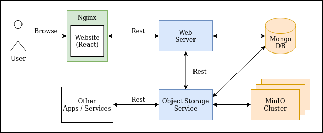

# TempFileDrop.io

TempFileDrop.io is a project that replicates [file.io](https://www.file.io/) which is a super simple file sharing application.
The purpose of this project is to understand the mechanics behind building an object storage service application. The following
tech stack will be applied:
- **React** - front facing website
- **Nginx** - Web server to serve website
- **MinIO** - object storage server
- **Spring Boot** - API web services
- **Docker** - Containerization

**Table of Content**
- [Architecture Design](#architecture-design)
- [Usage](#usage)
    - [Start MinIO Service](#start-minio-service)
    - [Start TempFileDrop.io Service](#start-tempfiledropio-service)
- [References](#references)
    - [Command Cheat Sheet](doc/CHEATSHEET.md)

**Development Plan**
1. Features
    - Upload
        - Return webserver a link to download
        - Presigned URL (Temporary uploads)
        - Advanced Settings (Expiry...)
        - Ensure filesnames are unique (Random UUID + Timestamp?)
        - Group uploads in to a single folder 
    - Dashboard
        - Webserver stores <user -- objects> mapping (For Dashboard)
        - Show dashboard
2. Implement Security
    - Spring Security
    - TLS (HTTPS) 
    - IAM for MinIO Cluster
    - Better handle Response Code
    - Bucket Authorization
3. Others
    - Register - Ensure users are unique
    - Developer Swagger Page
    - Create logo
    - Make the object service and file service conditional

## Architecture Design



### Design Considerations

1. How much space do we need for the MinIO Cluster
2. API Service
    - Batch Calls
    - Speed of transfer
    - Mode of transfer
    - How much load can it handles
3. File Upload Mechanism
    - **Option A - Direct File Upload**
        - use HTTP `Content-Type` header on request to set the proper content
            ```
            PUT /profile/image HTTP/1.1
            Content-Type: image/jpeg
            Content-Length: 284
            
            raw image content...
            ```
        - This is a straightforward method that is recommended in most cases
    - **Option B - Multipart HTTP request [SELECTED]**
        - useful to support `uploading of multiple files at once` as well as supporting `different metadata` (eg combination 
        of images and JSON) in the same request
        - We will be using a variation of this **Mixed Multipart** which is a Multipart request with json
    - **Option C - Two-step: Metadata + Upload**
        - Submit meta-data first using `POST` method and return a `201 Created` with the location of where to upload the content
        - Submit a `PUT` request to upload content
4. Possible File Upload Vulnerabilities
    - **Server Side Request Forgery Vulnerability**
5. Possible File Upload Defence
    - Renaming file name -- harder for attacker to find their uploaded file

## Usage

### Start MinIO Service

1. Start the MinIO Distributed Cluster
    ```bash
    cd minio
    sudo rm -rf storage
    docker-compose up -d
    ```

2. Start the Storage Service
    ```bash
    ./gradlew storage-service:bootRun
    ```

### Start TempFileDrop.io Service

1. Start up the Database
    ```bash 
    cd database
    cd mongodata && sudo rm -rf * && cd ..     # OPTIONAL
    docker-compose up -d
    ```
2. Start the Web Server
    ```bash
    ./gradlew webserver:bootRun
    ```
3. Start the Web Application
    ```bash
    cd webapp
    yarn install
    yarn start
    ```

## References
- [Command Cheat Sheet](doc/CHEATSHEET.md)
- API Design
    - [API Design Guidance: File Upload](https://tyk.io/api-design-guidance-file-upload/)
- Frontend
    - [How to add login Authentication to React Applications](https://www.digitalocean.com/community/tutorials/how-to-add-login-authentication-to-react-applications)
    - [React Login Authentication using useContext and useReducer](https://soshace.com/react-user-login-authentication-using-usecontext-and-usereducer/)
    - [React File Upload/Download Example with Spring Rest Api](https://bezkoder.com/react-file-upload-spring-boot/)
    - [React-Dropzone.js](https://react-dropzone.js.org/)
        - [Tutorial Example 1](https://www.digitalocean.com/community/tutorials/react-react-dropzone)
        - [Tutorial Example 2](https://www.newline.co/@dmitryrogozhny/how-to-drag-and-drop-files-in-react-applications-with-react-dropzone--c6732c93)
        - [CSS Tricks: Drag and drop for file uploading](https://css-tricks.com/drag-and-drop-file-uploading/)
- Backend
    - Multipart Upload
        - [Spring Boot Multipart File Upload to Folder](https://bezkoder.com/spring-boot-file-upload/)
        - [Spring Boot Uploading and Downloading file from MinIO object store](https://blogs.ashrithgn.com/spring-boot-uploading-and-downloading-file-from-minio-object-store/)
        - [File Upload with Spring MVC](https://www.baeldung.com/spring-file-upload)
    - Multipart request with Json
        - [RequestBody and Multipart on Spring Boot](https://blogs.perficient.com/2020/07/27/requestbody-and-multipart-on-spring-boot/)
        - [Multiple files upload with request body using spring boot and test using Postman](https://medium.com/@pankajsingla_24995/multipart-request-with-request-body-using-spring-boot-and-test-using-postman-6ea46b71b75d)
        - [Stackoverflow - React Multipart file and JSON data](https://stackoverflow.com/questions/59235491/react-ajax-request-with-multipart-file-and-json-data)
        - [Spring Rest Template Multipart Upload](https://www.baeldung.com/spring-rest-template-multipart-upload)
        - [Stackoverflow - How do I send a multipart file using spring rest template](https://stackoverflow.com/questions/55138538/how-do-i-send-a-multipartfile-using-spring-resttemplate)
    - Forwarding request (Service to Service) in Spring
        - [Stackoverflow - How to send Multipart form data with restTemplate Spring-mvc](https://stackoverflow.com/questions/28408271/how-to-send-multipart-form-data-with-resttemplate-spring-mvc)
    - MinIO
        - [Deploy MinIO on Kubernetes](https://docs.min.io/docs/deploy-minio-on-docker-compose.html)
    - Exception handling
        - [Spring Template Error Handling](https://www.baeldung.com/spring-rest-template-error-handling)
        - [Log your rest template without destroying the body](https://objectpartners.com/2018/03/01/log-your-resttemplate-request-and-response-without-destroying-the-body/)