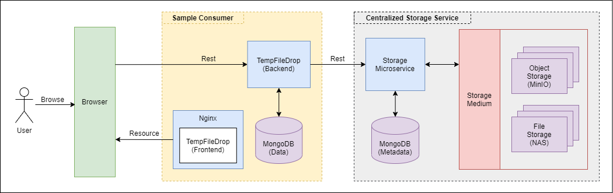
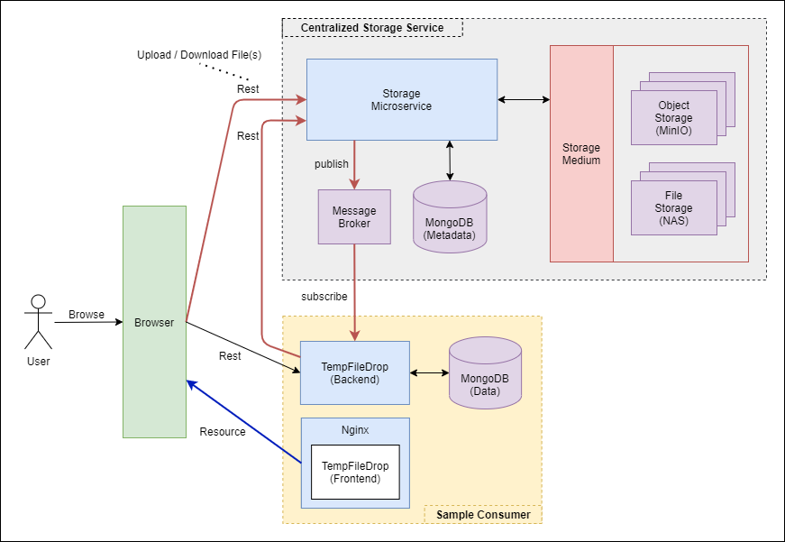
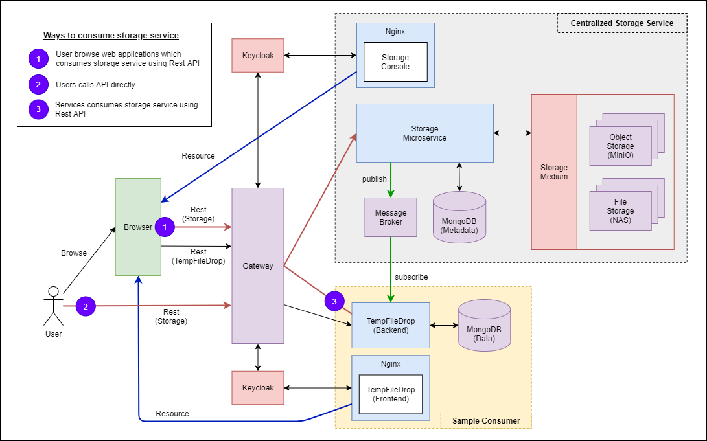
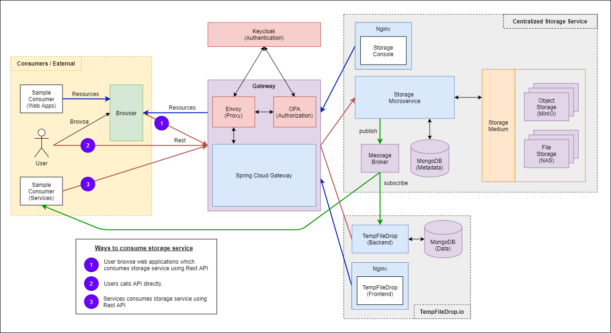

# Storage Service Research

**Table of Content**
- [Overview](#overview)
- [Architecture Design](#architecture-design)
- [Getting Started](design4)
- [How to consume storage service](design4/storage-service/README.md#how-to-consume-centralized-storage-service)
- [Design Considerations](#design-considerations)
- [Future Works](#future-works)
- [References](#references)
    - [Command Cheat Sheet](doc/CHEATSHEET.md)
    
## Overview

There are 3 main purpose of this project.
1. **To design a centralized storage service.**
    - Storage Medium will be based on either **file storage (NAS)** or **object storage (MinIO)**
    - Storage Service acts as an **abstraction layer** such that consumers do not consume the storage medium directly.
    - Features include:
        - **Scheduled Cleanup** based on the following settings
            - **Expiry datetime** for files
            - **Max Downloads** allowed
        - **Event Feedback** when files are uploaded / downloaded / deleted
        - **Anonymous Upload / Download**
2. **To create a temporary file sharing application.**
    - **TempFileDrop.io** is a project that replicates [file.io](https://www.file.io/) which is a super simple file sharing application.
    - Understand **file uploads / downloads using Rest** 
3. **To experiment with having API Gateway for authentication**

**Technology Stack:**
- **React** - Website Framework
- **Nginx** - Web server to serve website
- **MinIO** - Object storage server
- **Spring Boot** - API web services
- **Rabbit MQ** - Publish / Subscribe Messages
- **Docker** - Containerization
- **Keycloak** - Authentication / Authorization Server
- **Open Policy Agent** - Authorization

**For more details on implementation, refer to the README of the individual services**
- [Design v1 [Archive]](#version-1---backend-proxy)
- [Design v2 [Archive]](#version-2---direct-consumption-with-event-feedback)
- [Design v3 [Archive]](#version-3---api-gateway-authentication)
- **[Design v4 [Current]](#version-4---api--app-gateway-current)**
    - [TempFileDrop Website](design4/tempfiledrop/webapp)
    - [TempFileDrop Web Server](design4/tempfiledrop/webserver)
    - [storage-js-client](design4/storage-js-client)
    - [storage-component-library](design4/storage-component-library)
    - [Storage Admin Console](design4/storage-console)
    - [Storage Microservice](design4/storage-service)
    - [API Gateway](infra/gateway)

## Architecture Design

### Version 1 - Backend Proxy



This is the first conceptualized design of the centralized storage service where I use the consumer's backend to act as
a proxy for user's upload/download request. Below is the list of available implementations. Refer to the 
[design 1's documentation](archive/design1) for more information.
- **Object Storage** based on s3 bucket concepts
- Basic **multipart upload / download / delete / list files**
- Scheduled Clean up based on **maximum download count / expiry Period**
- File Storage in either **Local File Storage** or **MinIO docker cluster**

### Version 2 - Direct Consumption with Event Feedback



This design is built upon the first implementation. Instead of relaying the http request, consumers will make request to 
the centralized storage service, and an event will be published when the request is completed. Previously, the following
features were implemented:

- **Object Storage** based on s3 bucket concepts
- Basic **multipart upload / download / delete / list files**
- Scheduled Clean up based on **maximum download count / expiry Period**
- File Storage in either **Local File Storage** or **MinIO docker cluster**

In additional to the implementations above, I have added the implementations below. Refer to the [design 2's documentation](archive/design2) 
for more information.
- **Event Feedback** when file upload / download / delete event occur
- **Anonymous uploads / downloads**
- **Streaming File Upload**
- **Keycloak authentication** - all services are registered as keycloak client

### Version 3 - API Gateway Authentication



This design is built upon the second implementation. Instead of registering each backend services as a keycloak client,
I used an API Gateway to manage authentication. Previously, the following features were implemented:

- **Object Storage** based on s3 bucket concepts
- Basic **multipart upload / download / delete / list files**
- Scheduled Clean up based on **maximum download count / expiry Period**
- File Storage in either **Local File Storage** or **MinIO docker cluster**
- **Event Feedback** when file upload / download / delete event occur
- **Anonymous uploads / downloads**
- **Streaming File Upload**
- **Keycloak authentication** - all services are registered as keycloak client **[UPDATED]**

In additional to the implementations above, I added a few more implementations below. Refer to the [design 3's documentation](archive/design3) 
for more information.
- **Keycloak authentication**
    - Only Web Applications are registered as clients
    - Gateway is registered as client to handle authentication for backend services
- **API Gateway** with **Centralized Authentication**
- **Microservice authorization / validations**
    - Role Authorization using **Storage Gateway Client Roles**
    - API request validation by extracting **Client/Realm Role Attributes** (buckets, routingkeys, subscribers) from keycloak token
- **Storage Console** to view storage and events
- **storage-js-client** is a javascript client for web applications to communicate with storage service

### Version 4 - API + APP Gateway [Current]



This design is built upon the third implementation. Instead of registering the frontend web applications as keycloak client, 
I placed the webservers which are serving frontend resources behind the gateway. This provides a cleaner architecture where
authentication & authorization is handled purely by the gateway. Previously, the following features were implemented:

- **Object Storage** based on s3 bucket concepts
- Basic **multipart upload / download / delete / list files**
- Scheduled Clean up based on **maximum download count / expiry Period**
- File Storage in either **Local File Storage** or **MinIO docker cluster**
- **Event Feedback** when file upload / download / delete event occur
- **Anonymous uploads / downloads**
- **Streaming File Upload**
- **Keycloak authentication** -- **[UPDATED]**
    - Only Web Applications are registered as clients
    - Gateway is registered as client to handle authentication for backend services
- **API Gateway** with **Centralized Authentication**
- **Microservice authorization / validations**
    - Role Authorization using **Storage Gateway Client Roles**
    - API request validation by extracting **Client/Realm Role Attributes** (buckets, routingkeys, subscribers) from keycloak token
- **Storage Console** to view storage and events
- **storage-js-client** is a javascript client for web applications to communicate with storage service

In additional to the implementations above, I added a few more implementations below. Refer to the design 4's documentation(design4)
for more information.
- **Web Applications** are behind the gateway
- **Keycloak authentication**
    - Only Gateway is registered as client to handle authentication for backend services and web applications
- **Open Policy Agent (OPA)** for authorization at gateway
- **Storage Component Library** for reusable react components

## Design Considerations

1. How much space do we need for the MinIO Cluster
2. API Service
    - Batch Calls
    - Speed of transfer
    - Mode of transfer
    - How much load can it handles (Out of Memory Issues)
3. File Upload Mechanism
    - **Option A - Direct File Upload**
        - use HTTP `Content-Type` header on request to set the proper content
            ```
            PUT /profile/image HTTP/1.1
            Content-Type: image/jpeg
            Content-Length: 284
            
            raw image content...
            ```
        - This is a straightforward method that is recommended in most cases
    - **Option B - Multipart HTTP request [SELECTED]**
        - useful to support `uploading of multiple files at once` as well as supporting `different metadata` (eg combination 
        of images and JSON) in the same request
        - We will be using a variation of this **Mixed Multipart** which is a Multipart request with json
    - **Option C - Two-step: Metadata + Upload**
        - Submit meta-data first using `POST` method and return a `201 Created` with the location of where to upload the content
        - Submit a `PUT` request to upload content
4. Possible File Upload Vulnerabilities
    - **Server Side Request Forgery Vulnerability**
    - **Defend Strategies**:
        - There should be a **whitelist** of allowed file types. This list determines the types of files that can be uploaded,
        and rejects all files that do not match the approved types.
        - **Client- or Server-side input validation** to ensure evasion techniques that have not been used to bypass the
        whitelist filter. These evasion techniques could include appending a second file type to the file name 
        (eg.. image.jph.php) or using trailing space or dots in the file name.
        - **Maximum filename length and file size** should be set.
        - Directory to which files are uploaded should be **outside of the website root**.
        - All uploaded files should be **scanned by antivirus software** before they are opened. 
        - App should not use **file names** supplied by user. Uploaded files should be renamed according to a predetermined
        condition. This makes it harder for attacker to find their uploaded files.
5. OAuth2 Pattern - We will make use of three common OAuth2 patterns, using Keycloak as the authorization server
    - **OpenID Connection Authentication** - pattern used for end-user authentication
    - **Token Relay** when a OAuth2 consumer service / application like the API gateway acts as a client and forwards the 
    incoming token to outgoing resource requests
    - **Client Credentials Grant** - the pattern to use when the authorized requestor is another service. In this case, 
    service to service authorization.

## Future Works

1. Implement Security
    - TLS (HTTPS) 
    - IAM for MinIO Cluster
    - Access Control of Storage Service
2. Storage Service
    - Monitoring Metrics with Grafana
    - File upload with Tus.io protocol (chunk based file upload)
        - Upgrade Storage Service
        - Upgrade TempFileDrop
    - Rate Limiting of API Gateway
    - Storage Service Javascript Client (NPM)
    - Storage Service Security Starter Library
    - Understand Logging
3. Misc
    - Upgrade to Reactive Web (use webclient instead of restTemplate)
    - Make Navbar reactive to small screen (Frontend)
    - Viewing Nginx Logs in Docker Logs
    - Kubernetes Deployment (Production Mode)
        - https / wss
    - Websocket (with security)
    
## References
- [Command Cheat Sheet](doc/CHEATSHEET.md)
- API / S3 Design
    - [API Design Guidance: File Upload](https://tyk.io/api-design-guidance-file-upload/)
    - [Stackoverflow - How do web applications typically interact with amazon s3](https://stackoverflow.com/questions/54655279/how-do-web-applications-typically-interact-with-amazon-s3)
    - [How to gracefully store user files](https://stormpath.com/blog/how-to-gracefully-store-user-files)
    - [Stateful vs Stateless Web Services](https://nordicapis.com/defining-stateful-vs-stateless-web-services/)
- Authentication
    - [How to add login Authentication to React Applications](https://www.digitalocean.com/community/tutorials/how-to-add-login-authentication-to-react-applications)
    - [React Login Authentication using useContext and useReducer](https://soshace.com/react-user-login-authentication-using-usecontext-and-usereducer/)
    - [Stackoverflow - where to store access token in Reactjs](https://stackoverflow.com/questions/48983708/where-to-store-access-token-in-react-js)
        - [Getting token authentication right in a stateless single page application](https://medium.com/lightrail/getting-token-authentication-right-in-a-stateless-single-page-application-57d0c6474e3)
    - [Please stop using local storage](https://dev.to/rdegges/please-stop-using-local-storage-1i04)
    - [Best practises of using JWT in frontend](https://hasura.io/blog/best-practices-of-using-jwt-with-graphql/#jwt_vs_session)
    - [Authentication and Authorization in microservices, and how to implement it](https://medium.com/swlh/authentication-and-authorization-in-microservices-how-to-implement-it-5d01ed683d6f)
    - [Understanding Spring Security](https://www.marcobehler.com/guides/spring-security)
    - [Rest Security with JWT (Spring Security)](https://www.toptal.com/java/rest-security-with-jwt-spring-security-and-java)
        - [Github Sample](https://github.com/szerhusenBC/jwt-spring-security-demo)
- OPA Authorization
    - [Stackoverflow: Union an array of objects in Rego](https://stackoverflow.com/questions/64562266/union-an-array-of-objects-in-rego)
- API Gateway
    - [API Gateway Pattern](https://www.nginx.com/blog/choosing-the-right-api-gateway-pattern/)
    - [Okta - spring gateway patterns](https://developer.okta.com/blog/2020/08/14/spring-gateway-patterns)
    - [Logging Filter](https://www.borischistov.com/articles/2)
    - [UI Gateway](https://sdoxsee.github.io/blog/2019/12/17/merry-microservices-part2-ui-gateway.html)
    - [Spring Cloud gateway Oauth2 with Keycloak](https://piotrminkowski.com/2020/10/09/spring-cloud-gateway-oauth2-with-keycloak/)
    - [Microservices authentication and authorization with Keycloak at Gateway level](https://javatodev.com/microservices-authentication-and-authorization-with-keycloak/)
    - [Spring Cloud Gateway with JWT Authentication](https://ihorkosandiak.medium.com/spring-cloud-gateway-security-with-jwt-93341b342020)
    - [Okta - Spring Reactive Microservices with Spring Cloud Gateway](https://developer.okta.com/blog/2019/08/28/reactive-microservices-spring-cloud-gateway)
- Spring Security
    - [Keycloak for Identity and Access Management & High Availability Deployment with Kubernetes](https://medium.com/devops-dudes/keycloak-for-identity-and-access-management-9860a994bf0)
    - [Baeldung - Spring Boot + Keycloak](https://www.baeldung.com/spring-boot-keycloak)
    - [Securing Spring Boot Rest APIs with Keycloak](https://medium.com/devops-dudes/securing-spring-boot-rest-apis-with-keycloak-1d760b2004e)
    - [Secure Frontend (React) and Backend (Node JS Express Rest API) with Keycloak](https://medium.com/devops-dudes/secure-front-end-react-js-and-back-end-node-js-express-rest-api-with-keycloak-daf159f0a94e)
    - [Role Based Access Control for multiple keycloak clients](https://janikvonrotz.ch/2020/04/30/role-based-access-control-for-multiple-keycloak-clients/)
    - [Spring Security + Keycloak](https://www.thomasvitale.com/spring-security-keycloak/)
    - [Keycloak authentication flow SSO Client](https://www.thomasvitale.com/keycloak-authentication-flow-sso-client/)
    - [Using Spring Boot OAuth2 instead of Keycloak adapters](https://medium.com/@bcarunmail/securing-rest-api-using-keycloak-and-spring-oauth2-6ddf3a1efcc2)
    - [Using Spring Boot OAuth2 instead of Keycloak adapters](https://wstutorial.com/rest/spring-security-oauth2-keycloak.html)
    - [Stackoverflow - Why do Bearer-only clients exist?](https://stackoverflow.com/questions/58911507/keycloak-bearer-only-clients-why-do-they-exist)
    - [Keycloak RestTemplate with Spring Boot Security Integration](https://ramonak.io/posts/vaadin%E2%80%93keycloak%E2%80%93spring-security-integration)
    - [Stackoverflow - Custom Realm / Client Role attributes with script mapper](https://stackoverflow.com/questions/55702315/accessing-keycloak-roles-users-attributes-from-java-api)
        - [Add to Claims](https://gist.github.com/webdeb/d8a99df9023f01b78e3e8ff580abe10b)
        - [Expose Realm Attributes](https://lists.jboss.org/pipermail/keycloak-user/2019-February/017122.html)
        - [Using ## as delimiter for multiple values in attributes](https://stackoverflow.com/questions/60767085/keycloak-map-multiple-user-attributes)
    - [Securing inter service communication in microservice architecture](https://medium.com/@radutoev/securing-inter-service-communication-in-a-microservice-architecture-f413937012d4)
    - [Spring Security Context](https://www.javacodegeeks.com/2018/02/securitycontext-securitycontextholder-spring-security.html)
- Multipart upload / download
    - React & Axios
        - [React File Upload/Download Example with Spring Rest Api](https://bezkoder.com/react-file-upload-spring-boot/)
        - [React File Upload/Download Example with Spring Rest Api](https://bezkoder.com/react-file-upload-spring-boot/)
        - [React-Dropzone.js](https://react-dropzone.js.org/)
            - [Tutorial Example 1](https://www.digitalocean.com/community/tutorials/react-react-dropzone)
            - [Tutorial Example 2](https://www.newline.co/@dmitryrogozhny/how-to-drag-and-drop-files-in-react-applications-with-react-dropzone--c6732c93)
            - [CSS Tricks: Drag and drop for file uploading](https://css-tricks.com/drag-and-drop-file-uploading/)
        - [Stackoverflow - How to download files using Axios](https://stackoverflow.com/questions/41938718/how-to-download-files-using-axios)
        - [Stackoverflow - How tp download file in reactjs](https://stackoverflow.com/questions/50694881/how-to-download-file-in-react-js)    
    - Spring Boot
        - Upload
            - [Spring Boot Multipart File Upload to Folder](https://bezkoder.com/spring-boot-file-upload/)
            - [Spring Boot Uploading and Downloading file from MinIO object store](https://blogs.ashrithgn.com/spring-boot-uploading-and-downloading-file-from-minio-object-store/)
            - [File Upload with Spring MVC](https://www.baeldung.com/spring-file-upload)
            - [Spring Boot File Upload/Download](https://www.devglan.com/spring-boot/spring-boot-file-upload-download)
            - [Upload Large Files with Spring Boot](https://blog.sayem.dev/2017/07/upload-large-files-spring-boot-html/)
            - [Upload large file in Spring Boot 2 application](https://dzone.com/articles/upload-large-file-in-spring-boot-2-application-usi)
            - [Advanced Spring File Upload](https://medium.com/swlh/advanced-spring-file-upload-6595d3c2b8f9)
            - [Use RestTemplate cross-service large file uploads, probably 2G](https://www.programmersought.com/article/64782425852/)
        - Download
            - [Springboot single file download, multiple files zip package](https://www.programmersought.com/article/2688897886/)
            - [Stackoverflow - Difference between return byte array and input stream](https://stackoverflow.com/questions/49050569/is-there-a-difference-between-returning-byte-array-or-servlet-output-stream-on-f)
            - [Spring Rest Template Download large file](https://www.baeldung.com/spring-resttemplate-download-large-file)
            - [Spring Boot File Download](https://o7planning.org/11765/spring-boot-file-download)
            - [Download Server](https://github.com/nurkiewicz/download-server)
            - [Download a file using Spring RestTemplate](https://www.javacodemonk.com/download-a-file-using-spring-resttemplate-75723d97)
            - [Spring MVC Image Media Data](https://www.baeldung.com/spring-mvc-image-media-data)
            - [Stackoverflow - Spring MVC Large file download (Out of Memory Issue)](https://stackoverflow.com/questions/15800565/spring-mvc-large-files-for-download-outofmemoryexception)
            - [Bad Chunk Header mystery](https://rey5137.com/bad-chunk-header-mystery/)
            - [Stackoverflow -  Get opened input stream from rest template for large file processing](https://stackoverflow.com/questions/34936101/get-opened-input-stream-from-rest-template-for-large-file-processing)
        - Upload with JSON Data
            - [RequestBody and Multipart on Spring Boot](https://blogs.perficient.com/2020/07/27/requestbody-and-multipart-on-spring-boot/)
            - [Multiple files upload with request body using spring boot and test using Postman](https://medium.com/@pankajsingla_24995/multipart-request-with-request-body-using-spring-boot-and-test-using-postman-6ea46b71b75d)
            - [Stackoverflow - React Multipart file and JSON data](https://stackoverflow.com/questions/59235491/react-ajax-request-with-multipart-file-and-json-data)
            - [Spring Rest Template Multipart Upload](https://www.baeldung.com/spring-rest-template-multipart-upload)
            - [Stackoverflow - How do I send a multipart file using spring rest template](https://stackoverflow.com/questions/55138538/how-do-i-send-a-multipartfile-using-spring-resttemplate)
- Nginx Proxy
    - [Set up proxy to work with multiple apis in create-react-app](https://create-react-app.dev/docs/proxying-api-requests-in-development/#configuring-the-proxy-manually)
- Forwarding Request/Response (Service to Service in Spring)
    - [Stackoverflow - How to send Multipart form data with restTemplate Spring-mvc](https://stackoverflow.com/questions/28408271/how-to-send-multipart-form-data-with-resttemplate-spring-mvc)
    - [Stackoverflow - How to proxy a http video stream to any number of clients](https://stackoverflow.com/questions/47277640/how-to-proxy-a-http-video-stream-to-any-amount-of-clients-through-a-spring-webse)
- Spring Boot Exception
    - [Spring Template Error Handling](https://www.baeldung.com/spring-rest-template-error-handling)
    - [Log your rest template without destroying the body](https://objectpartners.com/2018/03/01/log-your-resttemplate-request-and-response-without-destroying-the-body/)
- Swagger
    - [Documenting a Spring REST API Using OpenAPI 3.0](https://www.baeldung.com/spring-rest-openapi-documentation)
    - [Swagger Authentication](https://sourabhparsekar.medium.com/openapi-specification-swagger-authentication-c150f86748ea)
    - [Enable Authorize Button in Swagger UI](https://stackoverflow.com/questions/59898874/enable-authorize-button-in-springdoc-openapi-ui-for-bearer-token-authentication/60666209#60666209)
    - [Spring Cloud Gateway Consolidate Swagger](https://piotrminkowski.com/2020/02/20/microservices-api-documentation-with-springdoc-openapi/)
- Spring Cloud Stream + RabbitMQ
    - [Okta - spring cloud stream 3.0](https://developer.okta.com/blog/2020/04/15/spring-cloud-stream)
    - [Introduction to event driven microservices with spring cloud stream](https://piotrminkowski.com/2020/06/05/introduction-to-event-driven-microservices-with-spring-cloud-stream/)
    - [RabbitMQ docker-compose with default properties](https://github.com/changhuixu/rabbitmq-labs/tree/master/02_QueueProperties)
    - [Stackoverflow - Set Routing Key for Producer](https://stackoverflow.com/questions/52329361/spring-cloud-stream-reactive-how-to-set-routing-key-for-producer)
    - [Stackoverflow - Set multiple routing key for Consumer](https://stackoverflow.com/questions/50587227/multiple-bindingroutingkeys-for-a-consumer-with-spring-cloud-stream-using-rabbi)
- MinIO
    - [Deploy MinIO on Kubernetes](https://docs.min.io/docs/deploy-minio-on-docker-compose.html)
- Nginx
    - [Nginx as reverse proxy in front of keycloak](https://itnext.io/nginx-as-reverse-proxy-in-front-of-keycloak-21e4b3f8ec53)
    - [Keycloak with Java and ReactJS](https://www.powerupcloud.com/keycloak-with-java-and-reactjs/)
- WebSocket
    - [Websockets with react & express](https://dev.to/ksankar/websockets-with-react-express-part-2-4n9f)
    - [React Managing Websockets with redux and context](https://rossbulat.medium.com/react-managing-websockets-with-redux-and-context-61f9a06c125b)
    - [Baeldung - Spring Security Websockets](https://www.baeldung.com/spring-security-websockets)
    - [Stackoverflow - Spring Websocket authentication with spring security and keycloak](https://stackoverflow.com/questions/50573461/spring-websockets-authentication-with-spring-security-and-keycloak)
        - [Spring web socket Keycloak](https://github.com/stakater-lab/spring-web-socket-keycloak/blob/master/application/src/main/java/io/aurora/socketapp/config/WebSocketConfig.java)
        - [Stackoverflow - json web token jwt with Spring based sockjs stomp websocket](https://stackoverflow.com/questions/30887788/json-web-token-jwt-with-spring-based-sockjs-stomp-web-socket/39456274#39456274)
    - [dzone.com - Build a secure app using spring boot and websocket](https://dzone.com/articles/build-a-secure-app-using-spring-boot-and-websocket)
    - [okta - java spring websocket secure](https://developer.okta.com/blog/2019/10/09/java-spring-websocket-tutorial)
    - [Stomp Spring Boot Websocket](https://www.toptal.com/java/stomp-spring-boot-websocket)
- React / Javascript
    - [Eslint for Typescript](https://khalilstemmler.com/blogs/typescript/eslint-for-typescript/)
- Misc
    - [Stackoverflow - Algorithm for folder structure](https://stackoverflow.com/questions/7433414/help-to-write-an-algorithm-for-folders-structure)
    - [Stackoverflow - Spring Security 403 for POST/DELETE but ok for GET](https://stackoverflow.com/questions/19468209/spring-security-403-error)
    - [How microservies communicate](https://medium.com/geekculture/microservices-apis-a7b43ce850ee)
    - [Stackoverflow - Create-React-app reroute hot reload client](https://stackoverflow.com/questions/59936123/howto-re-route-webpack-hot-reload-client)
    