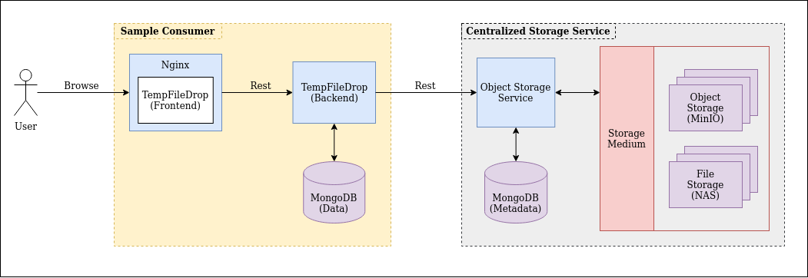

# TempFileDrop

**Table of Content**
- [Overview](#overview)
- [Architecture Design](#architecture-design)
- [Usage](#usage)
    - [Start Infrastructure Cluster](#start-infrastructure-cluster)
    - [Start Centralized Storage Service](#start-centralized-storage-service)
    - [Start TempFileDrop.io Service](#start-tempfiledropio-service)
- [Future Works](#future-works)
- [References](#references)
    - [Command Cheat Sheet](doc/CHEATSHEET.md)
    
## Overview

There are 2 main purpose of this project.
1. **To design a centralized storage service.**
    - Storage Medium will be based on either **file storage (NAS)** or **object storage (MinIO)**
    - Storage Service acts as an **abstraction layer** such that consumers do not consume the storage medium directly.
    - Features include:
        - **Expiry datetime** for files
        - **Max Downloads** allowed
        - **Event Feedback** when files are uploaded / downloaded
2. **To create a temporary file sharing application.**
    - **TempFileDrop.io** is a project that replicates [file.io](https://www.file.io/) which is a super simple file sharing application.
    - Understand **file uploads / downloads using Rest** 
    
**Technology Stack:**
- **React** - Website Framework
- **Nginx** - Web server to serve website
- **MinIO** - Object storage server
- **Spring Boot** - API web services
- **Apache Kafka** - Event Streaming
- **Docker** - Containerization

**For more details on implementation, refer to the README of the individual services**
- [Website](webapp)
- [Web Server](webserver)
- [Storage Service](storage-service)
- [Storage Service Client Library](storage-service-client)

## Architecture Design

### First Design 



This is the first conceptualize design of the centralized storage service. Applications will upload files to their own
backend which will then proxy the request to the storage service. (Note that the backend have some logic which processes 
the uploaded files, hence it is necessary for the backend to be aware of the uploads instead of having the application 
upload directly to the storage service). 

However, after developing the features, I realized that the amount of hops required to upload and download files is simply 
not ideal...

### Second Design


To further optimize the first design, the applications will directly upload to the storage service instead of proxying 
through the backend. Event Streaming is added to update the backend when an upload / download is completed.

### Design Considerations

1. How much space do we need for the MinIO Cluster
2. API Service
    - Batch Calls
    - Speed of transfer
    - Mode of transfer
    - How much load can it handles (Out of Memory Issues)
3. File Upload Mechanism
    - **Option A - Direct File Upload**
        - use HTTP `Content-Type` header on request to set the proper content
            ```
            PUT /profile/image HTTP/1.1
            Content-Type: image/jpeg
            Content-Length: 284
            
            raw image content...
            ```
        - This is a straightforward method that is recommended in most cases
    - **Option B - Multipart HTTP request [SELECTED]**
        - useful to support `uploading of multiple files at once` as well as supporting `different metadata` (eg combination 
        of images and JSON) in the same request
        - We will be using a variation of this **Mixed Multipart** which is a Multipart request with json
    - **Option C - Two-step: Metadata + Upload**
        - Submit meta-data first using `POST` method and return a `201 Created` with the location of where to upload the content
        - Submit a `PUT` request to upload content
4. Possible File Upload Vulnerabilities
    - **Server Side Request Forgery Vulnerability**
5. Possible File Upload Defence
    - Renaming file name -- harder for attacker to find their uploaded file

## Usage

### Start Infrastructure Cluster

```bash
# Clean up persistent data [OPTIONAL]
./infra/cleanup.sh

# Start infra cluster instances
sudo docker-compose -f infra/minio/docker-compose.yaml up -d
sudo docker-compose -f infra/rabbitmq/docker-compose.yaml up -d
sudo docker-compose -f infra/mongo/docker-compose.yaml up -d
```

### Start Centralized Storage Service

1. Ensure that the following services are available
    - **Minio Cluster**
    - **RabbitMQ**
    - **MongoDB**
2. Start the Storage Service
    ```bash
    ./gradlew storage-service:bootRun
    ```

### Start TempFileDrop.io Service

1. Ensure that the following services are available
    - **Centralized Storage Service**
    - **RabbitMQ**
    - **MongoDB**
2. Start the Web Server
    ```bash
    ./gradlew webserver:bootRun
    ```
3. Start the Web Application
    ```bash
    cd webapp
    yarn install
    yarn start
    ```
   
## Future Works

1. Implement Security
    - Spring Security
    - TLS (HTTPS) 
    - IAM for MinIO Cluster
    - Bucket Authorization
2. Storage Service
    - Upgrade to WebClient instead of RestTemplate
    - Look at Presigned Url feature that is available in S3 storage
3. Misc
    - Session / Cache such that user remains login after refreshing...
    - Make Navbar reactive to small screen (Frontend)
    
## References
- [Command Cheat Sheet](doc/CHEATSHEET.md)
- API / S3 Design
    - [API Design Guidance: File Upload](https://tyk.io/api-design-guidance-file-upload/)
    - [Stackoverflow - How do web applications typically interact with amazon s3](https://stackoverflow.com/questions/54655279/how-do-web-applications-typically-interact-with-amazon-s3)
    - [How to gracefully store user files](https://stormpath.com/blog/how-to-gracefully-store-user-files)
- Frontend
    - [How to add login Authentication to React Applications](https://www.digitalocean.com/community/tutorials/how-to-add-login-authentication-to-react-applications)
    - [React Login Authentication using useContext and useReducer](https://soshace.com/react-user-login-authentication-using-usecontext-and-usereducer/)
    - [React File Upload/Download Example with Spring Rest Api](https://bezkoder.com/react-file-upload-spring-boot/)
    - [React-Dropzone.js](https://react-dropzone.js.org/)
        - [Tutorial Example 1](https://www.digitalocean.com/community/tutorials/react-react-dropzone)
        - [Tutorial Example 2](https://www.newline.co/@dmitryrogozhny/how-to-drag-and-drop-files-in-react-applications-with-react-dropzone--c6732c93)
        - [CSS Tricks: Drag and drop for file uploading](https://css-tricks.com/drag-and-drop-file-uploading/)
    - [Set up proxy to work with multiple apis in create-react-app](https://create-react-app.dev/docs/proxying-api-requests-in-development/#configuring-the-proxy-manually)
    - [Stackoverflow - How to download files using Axios](https://stackoverflow.com/questions/41938718/how-to-download-files-using-axios)
    - [Stackoverflow - How tp download file in reactjs](https://stackoverflow.com/questions/50694881/how-to-download-file-in-react-js)    
- Backend
    - Multipart Upload
        - [Spring Boot Multipart File Upload to Folder](https://bezkoder.com/spring-boot-file-upload/)
        - [Spring Boot Uploading and Downloading file from MinIO object store](https://blogs.ashrithgn.com/spring-boot-uploading-and-downloading-file-from-minio-object-store/)
        - [File Upload with Spring MVC](https://www.baeldung.com/spring-file-upload)
        - [Spring Boot File Upload/Download](https://www.devglan.com/spring-boot/spring-boot-file-upload-download)
        - [Upload Large Files with Spring Boot](https://blog.sayem.dev/2017/07/upload-large-files-spring-boot-html/)
        - [Upload large file in Spring Boot 2 application](https://dzone.com/articles/upload-large-file-in-spring-boot-2-application-usi)
        - [Advanced Spring File Upload](https://medium.com/swlh/advanced-spring-file-upload-6595d3c2b8f9)
        - [Use RestTemplate cross-service large file uploads, probably 2G](https://www.programmersought.com/article/64782425852/)
    - Multipart request with Json
        - [RequestBody and Multipart on Spring Boot](https://blogs.perficient.com/2020/07/27/requestbody-and-multipart-on-spring-boot/)
        - [Multiple files upload with request body using spring boot and test using Postman](https://medium.com/@pankajsingla_24995/multipart-request-with-request-body-using-spring-boot-and-test-using-postman-6ea46b71b75d)
        - [Stackoverflow - React Multipart file and JSON data](https://stackoverflow.com/questions/59235491/react-ajax-request-with-multipart-file-and-json-data)
        - [Spring Rest Template Multipart Upload](https://www.baeldung.com/spring-rest-template-multipart-upload)
        - [Stackoverflow - How do I send a multipart file using spring rest template](https://stackoverflow.com/questions/55138538/how-do-i-send-a-multipartfile-using-spring-resttemplate)
    - Forwarding request/response (Service to Service) in Spring
        - [Stackoverflow - How to send Multipart form data with restTemplate Spring-mvc](https://stackoverflow.com/questions/28408271/how-to-send-multipart-form-data-with-resttemplate-spring-mvc)
        - [Stackoverflow - How to proxy a http video stream to any number of clients](https://stackoverflow.com/questions/47277640/how-to-proxy-a-http-video-stream-to-any-amount-of-clients-through-a-spring-webse)
    - MinIO
        - [Deploy MinIO on Kubernetes](https://docs.min.io/docs/deploy-minio-on-docker-compose.html)
    - Exception handling
        - [Spring Template Error Handling](https://www.baeldung.com/spring-rest-template-error-handling)
        - [Log your rest template without destroying the body](https://objectpartners.com/2018/03/01/log-your-resttemplate-request-and-response-without-destroying-the-body/)
    - Download
        - [Springboot single file download, multiple files zip package](https://www.programmersought.com/article/2688897886/)
        - [Stackoverflow - Difference between return byte array and input stream](https://stackoverflow.com/questions/49050569/is-there-a-difference-between-returning-byte-array-or-servlet-output-stream-on-f)
        - [Spring Rest Template Download large file](https://www.baeldung.com/spring-resttemplate-download-large-file)
        - [Spring Boot File Download](https://o7planning.org/11765/spring-boot-file-download)
        - [Download Server](https://github.com/nurkiewicz/download-server)
        - [Download a file using Spring RestTemplate](https://www.javacodemonk.com/download-a-file-using-spring-resttemplate-75723d97)
        - [Spring MVC Image Media Data](https://www.baeldung.com/spring-mvc-image-media-data)
        - [Stackoverflow - Spring MVC Large file download (Out of Memory Issue)](https://stackoverflow.com/questions/15800565/spring-mvc-large-files-for-download-outofmemoryexception)
        - [Bad Chunk Header mystery](https://rey5137.com/bad-chunk-header-mystery/)
        - [Stackoverflow -  Get opened input stream from rest template for large file processing](https://stackoverflow.com/questions/34936101/get-opened-input-stream-from-rest-template-for-large-file-processing)
    - Swagger
        - [Documenting a Spring REST API Using OpenAPI 3.0](https://www.baeldung.com/spring-rest-openapi-documentation)