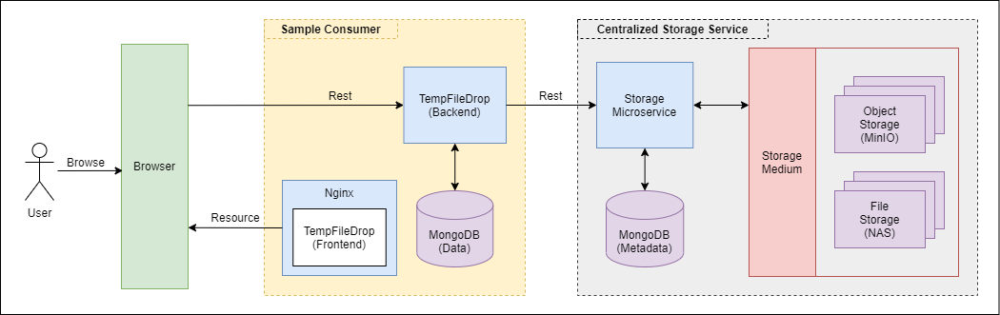
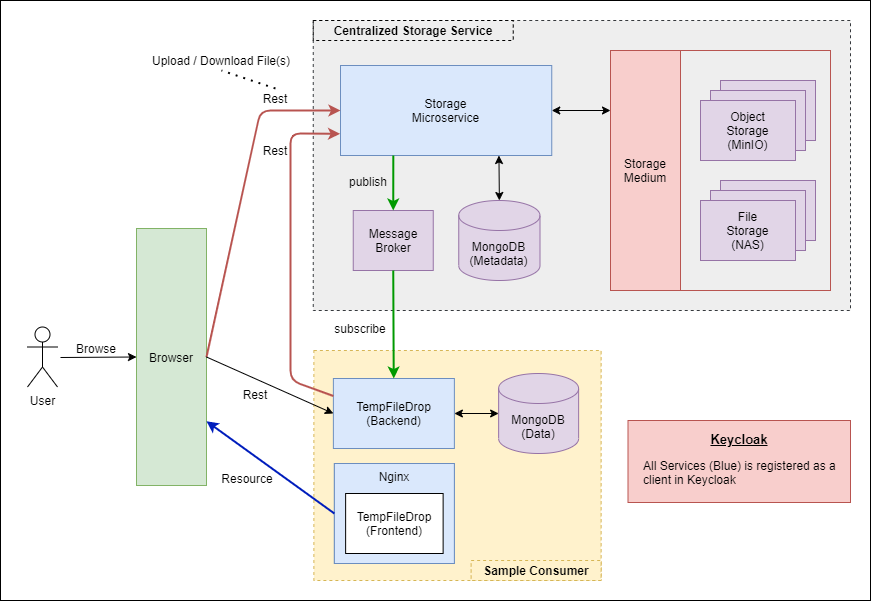
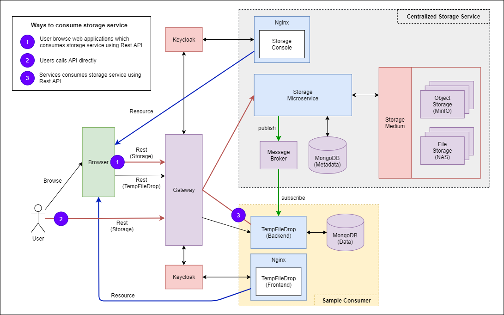

# Architecture Design Archives

## Version 1 - Proxy File Transfer Logic Abstraction using Microservice

Version 1 of this project is to abstract file transfer logic into a microservice. In most cases, files are uploaded
to a backend server which then uploads the file to a storage medium (Minio / File System). This logic is use in most
applications hence, it is possible to create a microservice which handles this file transfer logic. Do note that this 
is based on a proxy file upload pattern as shown in the diagram below.

### Version 1.0.0 - Initial Design

This is the first conceptualized design of the centralized storage service where I use the consumer's backend to act as
a proxy for user's upload/download request. Below is the list of available implementations. Refer to the 
[design 1's documentation](design1) for more information.
- **Object Storage** based on s3 bucket concepts
- Basic **multipart upload / download / delete / list files**
- Scheduled Clean up based on **maximum download count / expiry Period**
- File Storage in either **Local File Storage** or **MinIO docker cluster**

### Version 1.1.0 - Adding Notification 

This design is built upon the first implementation. Instead of relaying the http request, consumers will make request to 
the centralized storage service, and an event will be published when the request is completed. Previously, the following
features were implemented:

- **Object Storage** based on s3 bucket concepts
- Basic **multipart upload / download / delete / list files**
- Scheduled Clean up based on **maximum download count / expiry Period**
- File Storage in either **Local File Storage** or **MinIO docker cluster**

In additional to the implementations above, I have added the implementations below. Refer to the [design 2's documentation](design2) 
for more information.
- **Event Feedback** when file upload / download / delete event occur
- **Anonymous uploads / downloads**
- **Streaming File Upload**
- **Keycloak authentication** - all services are registered as keycloak client

### Version 1.2.0 - Adding Access Control

This design is built upon the second implementation. Instead of registering each backend services as a keycloak client,
I used an API Gateway to manage authentication. Previously, the following features were implemented:

- **Object Storage** based on s3 bucket concepts
- Basic **multipart upload / download / delete / list files**
- Scheduled Clean up based on **maximum download count / expiry Period**
- File Storage in either **Local File Storage** or **MinIO docker cluster**
- **Event Feedback** when file upload / download / delete event occur
- **Anonymous uploads / downloads**
- **Streaming File Upload**
- **Keycloak authentication** - all services are registered as keycloak client **[UPDATED]**

In additional to the implementations above, I added a few more implementations below. Refer to the [design 3's documentation](design3) 
for more information.
- **Keycloak authentication**
    - Only Web Applications are registered as clients
    - Gateway is registered as client to handle authentication for backend services
- **API Gateway** with **Centralized Authentication**
- **Microservice authorization / validations**
    - Role Authorization using **Storage Gateway Client Roles**
    - API request validation by extracting **Client/Realm Role Attributes** (buckets, routingkeys, subscribers) from keycloak token
- **Storage Console** to view storage and events
- **storage-js-client** is a javascript client for web applications to communicate with storage service