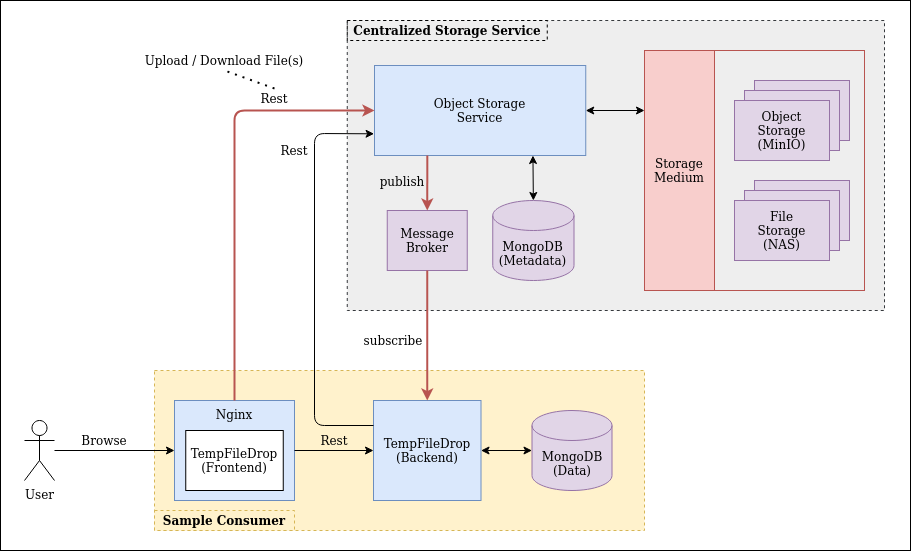

# Archive Designs

## Design 1 - Proxy

First design with basic implementation. The design was built around using the webserver as the main mode of communication
between the frontend and backend. Any storage related requests will be routed (or proxied) to the centralized storage 
service. 
- no authentication was implemented

## Design 2 - Direct Consumption with Event Feedback

 

The second design is an upgrade to the first implementation. Instead of proxying the storage request, all storage request 
will be made directly to the centralized storage service. Additional features were added to the design
- anonymous upload / download
- authentication with keycloak
- event feedback with rabbitmq
