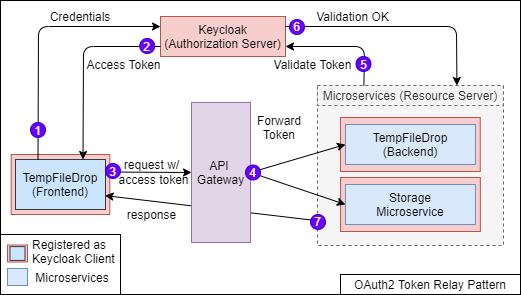

# Spring Cloud Gateway

Simple API Gateway to enable request rerouting. Possible responsibilities includes authentication, monitoring, load
balancing, caching, request shaping and management, and static response handling.

In our setup, we are using Spring Cloud Gateway as a **reverse proxy** as well as **centralized authentication** point.

## Usage

```bash
cd <root>
./gradlew design3:gateway:bootrun
```

## Gateway and Authentication Patterns

From my research, there seems to be a couple of gateway patterns. Below are some of the gateway pattern which I found to 
be more relevant my design

### Routing Gateway with Centralized Authentication + Token Relay (Current)


**Update**: Instead of letting microservices handle roles authorization, we will instead let API Gateway handle both
authentication and authorization. This way we will let the microservices focus on business logic. For security reason, 
the microservices will have to be in a private network or a secured namespace where the microservices can only be reached
via the api gateway.

### Routing Gateway with Token Relay


