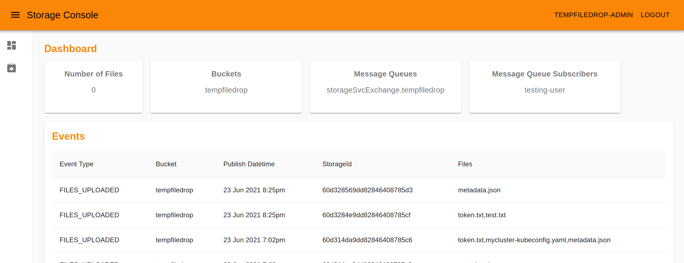
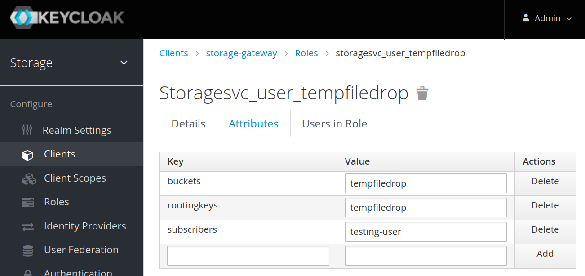
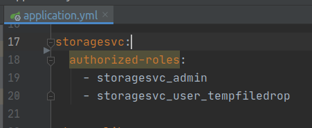

# Storage Console

Storage Console is a simple console for consumers/administrators to view their storage as well as trace the events.



As an administrator, to create a new service, you will need to do the following
1. Create **Bucket** for storage
2. Create **Message Queue** that is binded to a **routing key**
3. Create **RabbitMQ users** (subscribers) that **only have permission to the required message queue**
4. Create **client role** for storage-gateway in keycloak and add following **attributes** (buckets / routingkeys / subscribers) 
to the role. The way to add multiple values for attributes is to use **##**. Refer to diagram below.
    
5. **Authorized the client role** in storage service. Edit the application.yml
    

## Getting Started

Ensure that the following services are running...
- Centralized Storage Service
- Storage Gateway
- RabbitMQ
- Keycloak
- MongoDB
- Minio Cluster

Start the web application

```bash
yarn install
yarn start
```

## Data Source

| Data | Source | Remarks |
| --- | --- | --- |
| events | data_events (DB) | list of events tagged to consumer |
