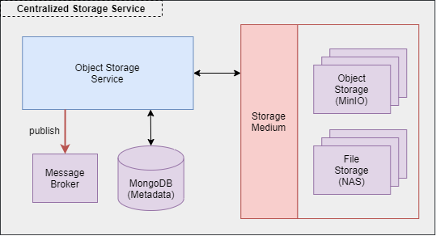
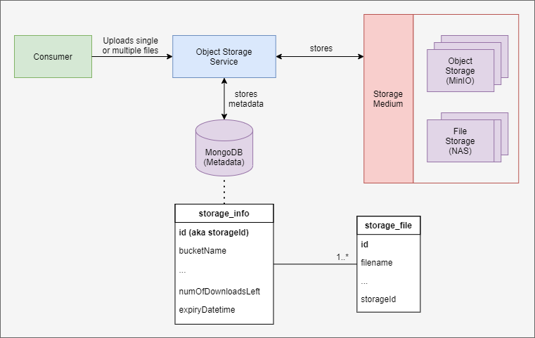
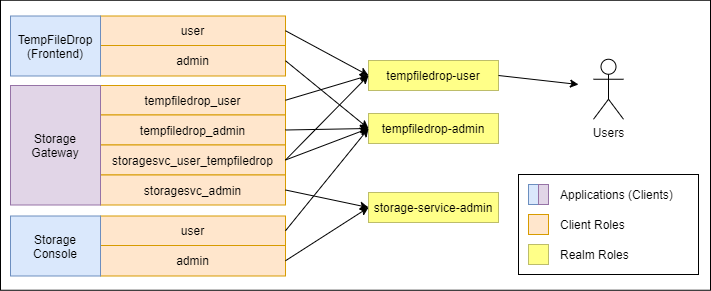

# Storage Service

Storage Service that provides REST API Endpoints for **uploading, downloading and listing** files stored in either 
**file storage (Folders)** or **object storage (MinIO)**

- [Getting Started](#getting-started)
    - [Configuring application.yaml](#configuring-applicationyaml)
    - [Running the service (locally)](#running-the-service-locally)
    - [Deploy the service](#deploying-the-service)
    - [Testing API upload with Postman](#testing-api-uploads-with-postman)
- [Documentation](#documentation)
    - [Storage Service Design](#storage-service-design)
        - [StorageId](#more-about-storageid)
    - [Database Tables](#database-tables)
    - [API Endpoints](#api-endpoints)
    - [Event Streaming using RabbitMQ](#event-streaming-using-rabbitmq)
    - [Keycloak Roles](#keycloak-roles)
- [How to consume Centralized Storage Service](#how-to-consume-centralized-storage-service)
    - [1. Configure HTTP Request](#1-configure-http-request)
        - [Http Authorization Header](#authorization-header)
        - [Uploading files](#uploading-files)
        - [Downloading files](#downloading-files)
        - [Deleting files](#deleting-files)
    - [2. RabbitMQ Queue Configuration](#2-rabbitmq-queue-configuration)
        - [Queue creation](#queue-creation)
        - [Consuming messages](#consuming-messages)
    - [3. Keycloak Authentication](#3-keycloak-authentication)

## Getting Started

### Configuring application.yaml

| Property Group | Property | Remarks |
| --- | --- | --- |
| storagesvc | storage-mode | Choice of storage mode = file / object |
| storagesvc.anonymous-upload | enable | enable anonymous upload |
| storagesvc.anonymous-upload | max-file-size | maximum file upload size for anonymous uploads |
| storagesvc.file-storage | upload-directory | directory to upload files to |
| storagesvc.object-storage | minio-endpoint | endpoint of minio cluster |
| storagesvc.object-storage | minio-access-key | access key for minio cluster |
| storagesvc.object-storage | minio-access-secret | access secret for minio cluster |

To configure upload file size, configure the properties below. For anonymous max upload size, use the property specified 
in the table above.

| Property Group | Property | Remarks |
| --- | --- | --- |
| spring.servlet.multipart | max-file-size | maximum file size for each request
| spring.servlet.multipart | max-request-size | maximum request size for a multipart/form-data

### Running the service (Locally)

```bash
# Go project's root
cd <ROOT>

# Create the exchange
python infra/rabbitmq/scripts/init_storagesvc.py --create-exchange -e storageSvcExchange

# Start the service
./gradlew archive:design2:storage-service:bootRun
```

### Deploying the service

TO BE ADDED...

### Testing API uploads with POSTMAN

Ensure `mongoDB`, `minIO` and `rabbitmq` is up. To test uploading of files, use `Postman` and use the settings below


## Documentation

### Storage Service Design



The centralized storage service is an abstraction layer over **storage medium** where the bulk of the exploration is based
on **Object Storage** with **MinIO**. Below are some of the key features available in the centralized storage service:
1. **Scheduled Files Cleanup**
    - Uploaded files can have an **expiry datetime** or **maximum download count** as a mechanism to store files temporary.
    - A **cronjob** is executed daily to clean up files that have expired.
    - **Expiry datetime** have **5 options**:
        - 1 hour
        - 1 day
        - 1 week
        - 1 month
        - no expiry 
2. **Event Feedback**
    - when files are uploaded / downloaded / deleted, an event will be triggered.
    - consumers can tagged the event with a **routingkey** such that only queues with this routing key will receive the message.
3. **Anonymous Uploads / Download**
    - no login is required to upload and download files.
    - Maximum upload size is 100MB 
        - Note that logic should be handled on Frontend to prevent more than 100MB uploads as backend will throw exceptions 
        which breaks the streaming upload. Hence, Frontend will receive Network error instead of a graceful error response.
    - Can be toggle off

#### More about StorageId



- Each upload is tag to a **storageId** which is stored as **metadata** in the database
- Following S3 convention, the consumer should have a **bucket** available in order to upload files

### Database Tables

| Table | Columns | Description |
| --- | --- | --- |
| storage_info | **id**, bucket, storagePath,  filenames, numOfDownloadsLeft, expiryDatetime, downloadLink | {storageId to files/object uploads} mapping. Given the **id** AKA **storageId**, the storage service will be able to identify the files uploaded and make them available for download. |
| storage_files | id, bucket, storagePath, filename, originalFilename, fileContentType, fileLength, storageId | Contains the uploaded files details |
| download_tokens | id, storageId, downloadKey, expiryDatetime | Cache for temporary download link |

### API Endpoints

Start the webapp and check out the swagger API Definitions.

### Event Streaming using RabbitMQ

This is the rough design on how events are send to consumers.


### Keycloak Roles

Below is a diagram on how roles are designed. 


## How to consume Centralized Storage Service

Refer to this section on how to consume the centralized storage service. There are 3 main configurations you will need to
consume the centralized storage service.

- [**Configure Http Request**](#1-configure-http-request)
- [**RabbitMQ Queue Configuration**](#2-rabbitmq-queue-configuration)
- [**Keycloak Authentication**](#3-keycloak-authentication)

### 1. Configure HTTP Request

For all the 3 types of request, it is necessary to provide **eventData [OPTIONAL]** and **eventRoutingKey**.
- **eventRoutingKey**: When upload is completed, an event will be published to the message broker using this routing key.
- **eventData**: This is an **OPTIONAL** field. When upload is completed, an event will be published to the message 
broker. This allows you to pass data to the consumer.

#### Authorization Header

However before you can call the rest endpoints of centralized storage service, you will need to ensure that you include 
the bearer token in the authorization header of the http request. An example is as follows:

```javascript
request.headers['Authorization'] = 'Bearer ' + token;
```

#### Uploading Files

When uploading files, you will be required to attach metadata (json object) to the upload. The metadata required is as
follows:

```bash
{
    bucket: "name_of_bucket",                               
    storagePath: "some/path",          
    maxDownloads: 1,
    expiryPeriod: 0,              
    eventRoutingKey: "routingkey",
    eventData: JSON.stringify({ key: "value" })
}
```

- **bucket**: your bucket
- **storagePath**: path to storage your file in the bucket. Can be an empty string which will store in root of bucket.
- **maxDownloads**: maximum number of downloads before file is deleted.
- **expiryPeriod**: this is an index value.
    - **0** = 1 hour
    - **1** = 1 day
    - **2** = 1 week
    - **3** = 1 month
    - **4** = no expiry

##### Sample Codes using Axios

```javascript
const uploadfunction = (uploadedFiles, userInfo) => {
    const formData = new FormData();
    const metadata = {
        bucket: "tempfiledrop",
        storagePath: "some/path",
        maxDownloads: 1,
        expiryPeriod: 0,        // 0 = 1 hour, 1 = 1 day, 2 = 1 week, 3 = 1 month, 4 = No Expiry
        eventRoutingKey: "tempfiledrop_upload",
        eventData: JSON.stringify({ username: username })
    };
    formData.append("metadata", new Blob([JSON.stringify(metadata)], {
        type: "application/json"
    }));    
    uploadedFiles.forEach(file => {
        formData.append("files", file);
    });

    // send request
    axios.post("/storagesvc/upload", formData, {})
};
```

##### Sample codes using RestTemplate

```kotlin
data class StorageInfo(
        val bucket: String,
        val folder: String
)
```

```kotlin
@PostMapping("/upload", consumes = [MediaType.MULTIPART_FORM_DATA_VALUE])
fun uploadFile(
        @RequestPart("files", required = true) files: List<MultipartFile>,
        @RequestPart("metadata", required = true) metadata: StorageInfo
): ResponseEntity<FileStorageResponse> {
    // craft header
    val headers = HttpHeaders()
    headers.contentType = MediaType.MULTIPART_FORM_DATA
    
    // craft body
    val body: MultiValueMap<String, Any> = LinkedMultiValueMap()
    body.add("metadata", metadata)
    files.forEach { body.add("files", it.resource) }
    
    // craft request
    val requestEntity: HttpEntity<MultiValueMap<String, Any>> = HttpEntity(body, headers)
    
    // craft rest template
    val storageServiceUrl = "http://storage.service.com/upload"
    val restTemplate = RestTemplate()
    val response = restTemplate.postForEntity(storageServiceUrl, requestEntity, String::class.java)
}
```

#### Downloading Files

When downloading files, observe the download pattern below. Get a temporary download link to download your files. If you
do not want a 2 stage download step, you can directly download using the `/api/storagesvc/download/secure/direct/{storageId}'
endpoint.


##### Sample Codes for downloading files

```javascript
axios.get(`/storagesvc/download/<ENDPOINT>`, {
    responseType: "blob",
    params: {
        eventRoutingKey: "routingkey"
    }
})
    .then(res => {
        const filename = extractFilenameFromContentDisposition(res.headers);
        const url = window.URL.createObjectURL(new Blob([res.data]));
        const link = document.createElement('a');
        link.href = url;
        link.setAttribute('download', filename);
        document.body.appendChild(link);
        link.click();
    })
    .catch(err => {
        console.log(err);
    });
```

#### Deleting Files

```javascript
 axios.delete(`/storagesvc/<BUCKET_NAME>/<STORAGE_ID>`, {
    params: {
        eventData: JSON.stringify({ key: "value" }),
        eventRoutingKey: "routingkey"
    }
})
    .then(res => console.log(res))
    .catch(err => console.log(err));
```

### 2. RabbitMQ Queue Configuration

#### Queue Creation

As a subscriber, you do not have permission to declare queues and bind to the exchange. It is necessary for administrators
to assist with queue creation. 

#### Consuming messages

To consume messages, follow the steps below

1. Install Dependencies - Spring Cloud Stream and RabbitMQ Binder
    ```bash
    dependencies { 
        implementation("org.springframework.cloud:spring-cloud-starter-stream-rabbit")
    }
    ```
2. Add configuration in **application.yaml** to bind queues to the **3 exchange (delete / download / upload)**
    ```yaml
    spring:
      rabbitmq:
        addresses: localhost:5672
        username: storage_subscriber
        password: storage123
      cloud:
        function:
          definition: storageSvcChannel
        stream:
          rabbit.bindings:
            storageSvcChannel-in-0.consumer:
              binding-routing-key-delimiter: ","
              binding-routing-key: tempfiledrop
              bind-queue: false                  
          bindings:
            storageSvcChannel-in-0:
              destination: storageSvcExchange     
              group: tempfiledrop               
    ```
    - **spring.cloud.rabbitmq** - RabbitMQ Cluster configuration
    - **spring.cloud.function.definition** - Notice that this binds to the names in our `RabbitMQConsumer.kt`
3. Create Consumer Class
    ```kotlin
    @Configuration
    class RabbitMQConsumer(
            private val storageService: StorageService,
    ) {
        companion object {
            private val logger = LoggerFactory.getLogger(RabbitMQConsumer::class.java)
        }
    
        @Bean
        fun storageSvcChannel(): Consumer<EventMessage> = Consumer {
            logger.info("Received Event (${it.eventType}) From Storage Service: $it")
            when (EventType.valueOf(it.eventType)) {
                EventType.FILES_DELETED -> storageService.processFilesDeletedEvent(it)
                EventType.FILES_DOWNLOADED -> storageService.processFilesDownloadedEvent(it)
                EventType.FILES_UPLOADED -> storageService.processFilesUploadedEvent(it)
            }
        }
    }
    ```
    
   ```kotlin
    enum class EventType {
        FILES_UPLOADED,
        FILES_DOWNLOADED,
        FILES_DELETED
    }
    ```
   
   ```kotlin
   data class EventMessage(
       val eventType: String,      // corresponds to EventType
       val storageId: String,
       val storagePath: String,
       val storageFiles: String,
       val bucket: String,
       val data: String            // corresponds to eventData which you passed in
   )
   ```

### 3. Keycloak Authentication

The centralized storage service handles authentication and authorization using Keycloak. To consume centralized storage service,
- **As an application / service**
    - Register your application as a **Client**
    - Create **client roles** and **realm roles** using the diagram above as an example
- **As a user**
    - Create a user in keycloak 
    - Assign the user your application's **realm role** which is a **composite role** that contains Storage Service 
    **client role: user**

#### Roles

