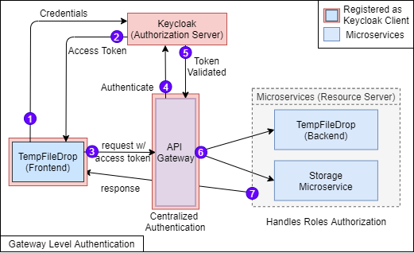
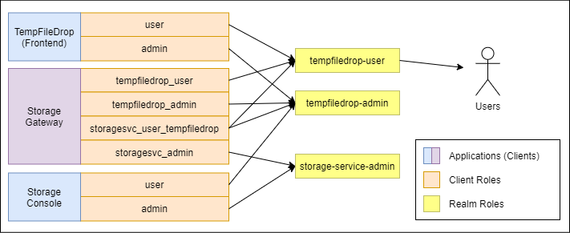

# Design v3 - API Gateway with Access Control


This design is an upgrade to the first and second implementation. Additional features such as **api gateway** and 
**storage console** was added. For more details, check out the [centralized storage service documentation](storage-service)
and [storage admin console documentation](storage-console).

**Table of Content**
- [Getting Started](#getting-started)
- [Authentication with Keycloak](#authentication-with-keycloak)
- [Event Feedback with RabbitMQ](#event-feedback-with-rabbitmq)

## Getting Started

Ensure that you have met the prerequisites below before using the guides below to start the project
- If you just want to start the project and view it, go to [quick start](#for-quick-start)
- If you want to work on development, go to [development](#for-development)
- If you want to deploy to kubernetes, go to [deployment](#for-deployment-to-kubernetes)

### Prerequisites

You will probably need to have the following installed
- Java 11
- Node 12
- Yarn
- Python + pip
- Docker + docker-compose

### For Quick Start

If you are just intending to run the project and test the features, run the scripts below. This will use docker-compose 
to start up all services required to get the minimal set up running.

```bash
# Install python module is you have yet to
pip install pika

# Quick Start the project
sudo scripts/quick_start_project.sh
```

Once you are done, you can clean up the project using the following script

```bash
sudo scripts/purge_project.sh
```

#### Quick Start Docker-Compose Setup


Check out the following endpoints:

```bash
# Browser
http://localhost:3000       - tempfiledrop web application (login = user:password)    -- ENTRY POINT
http://localhost:8080       - keycloak admin console (login = admin:admin)
http://localhost:15672      - rabbitmq console (login = admin:admin123)
http://localhost:9000       - minio console (login = minio:minio123)

# Rest Endpoints
http://localhost:7001       - tempfiledrop web server
http://localhost:8801       - centralized storage service

# Docker Containers
docker exec -it mongo_server bash       - mongo database (login = root:1234)
```

### For Development 

For active development, follow the steps below to get the environment set up

#### Start Infrastructure Cluster

```bash
# Clean up persistent data and restart the infra services (Fresh State)
sudo scripts/cleanup_and_restart_infra.sh

# Start Gateway
./gradlew design3:gateway:bootRun
```

#### Start Centralized Storage Service

1. Ensure that the following services are available
    - **Minio Cluster**
    - **RabbitMQ**
    - **MongoDB**
    - **Keycloak**
    - **Gateway**
2. Ensure that Exchange have been created
   ```bash
   # Create exchange if not created
   python infra/rabbitmq/scripts/init_storagesvc.py --create-exchange -e storageSvcExchange
   ```    
3. Start the Storage Service
    ```bash
    ./gradlew design3:storage-service:bootRun
    ```

#### Start TempFileDrop.io Service

1. Ensure that the following services are available
    - **Centralized Storage Service**
    - **RabbitMQ**
    - **MongoDB**
    - **Keycloak**
    - **Gateway**
2. Ensure that Queue binds to Exchange
    ```bash
    # Bind Queue to Exchange if not configured
    python infra/rabbitmq/scripts/init_storagesvc.py --create-queue -q storageSvcExchange.tempfiledrop
    python infra/rabbitmq/scripts/init_storagesvc.py --bind-queue -e storageSvcExchange -q storageSvcExchange.tempfiledrop -r tempfiledrop
    ```
3. Start the Web Server
    ```bash
    ./gradlew design3:tempfiledrop:webserver:bootRun
    ```
4. Start the Web Application
    ```bash
    cd tempfiledrop/webapp
    yarn install
    yarn start
    ```

### For Deployment to Kubernetes

#### Kubernetes Set up


## Authentication with Keycloak

The design is based on centralized authentication at gateway level and roles authorization at microservice level.



### Roles



## Event Feedback with RabbitMQ

