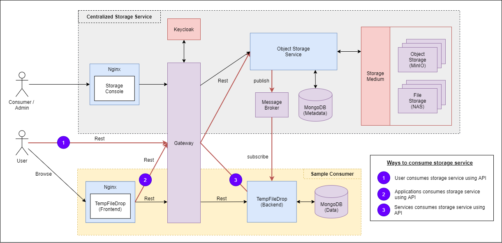

# Design v3 - API Gateway with Access Control

#### OAuth2 Patterns

We will make use of three common OAuth2 patterns, using Keycloak as the authorization server
- **OpenID Connection Authentication** - pattern used for end-user authentication
- **Token Relay** when a OAuth2 consumer service / application like the API gateway acts as a client and forwards the 
incoming token to outgoing resource requests
- **Client Credentials Grant** - the pattern to use when the authorized requestor is another service. In this case, 
service to service authorization.

