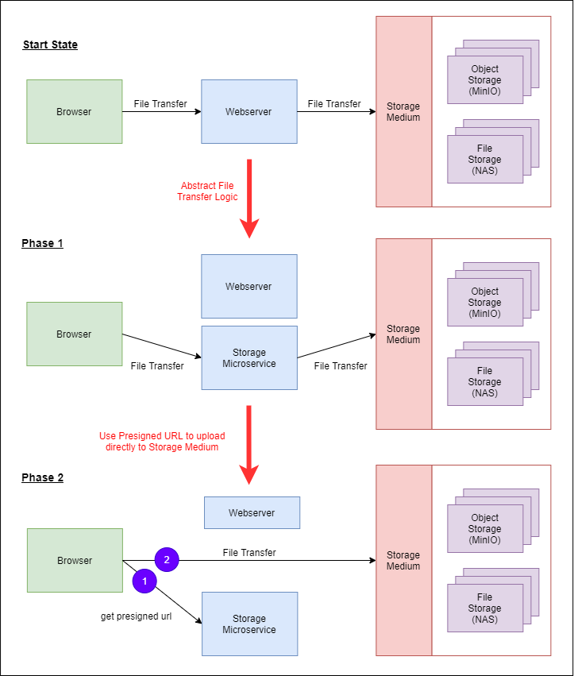

# Storage Service (Revamped)

Storage Service is a Microservice which provides REST API Endpoints for **file transfers**. There are 2 main modes for storing
files using the Storage Service namely **file storage (Folders)** or **object storage (Minio)**. Refer to the guide below for 
more details on each individual mode. 

- [Overview](#overview)
    - [Design](#design)
    - [Storage Medium Modes](#storage-medium-modes)
    - [Notification](#notification)
- [Getting Started](#getting-started)
- [Testing API Endpoints with Postman](#testing-api-endpoints-with-postman)

## Overview

The primary objective of this microservice is to abstract **file transfer logic** from developers. The fundamental idea is 
to let this microservice handle all storage related issues such as expiration / security / file upload vulnerabilities / etc...
The file storage design is based on Amazon S3 object storage concept where files are stored in buckets. Additionally, 
[notification](#notification) is included as a **core feature** of this microservice.



### Design


The centralized storage service is an abstraction layer over **storage medium** where the bulk of the exploration is based
on **Object Storage** with **MinIO**. Below are some of the key features available in the centralized storage service:
1. **Scheduled Files Cleanup**
    - Uploaded files can have an **expiry datetime** or **maximum download count** as a mechanism to store files temporary.
    - A **cronjob** is executed daily to clean up files that have expired.
    - **Expiry datetime** have **5 options**:
        - 1 hour
        - 1 day
        - 1 week
        - 1 month
        - no expiry 
2. **Event Feedback**
    - when files are uploaded / downloaded / deleted, an event will be triggered.
    - consumers can tagged the event with a **routingkey** such that only queues with this routing key will receive the message.
3. **Anonymous Uploads / Download**
    - no login is required to upload and download files.
    - Maximum upload size is 100MB 
        - Note that logic should be handled on Frontend to prevent more than 100MB uploads as backend will throw exceptions 
        which breaks the streaming upload. Hence, Frontend will receive Network error instead of a graceful error response.
    - Can be toggle off

### Storage Medium Modes

There are two main modes of storage namely **file storage (File System)** or **object storage (Minio)**. The storage microservice
can be configured to consume one of this mode.

#### File Storage Mode (File System)

This mode basically means that files are stored locally in the system. Below is a diagram on the file upload flow:


#### Object Storage Mode (Minio Cluster)

This mode basically means that files are stored as objects in Minio Cluster. There are two file upload flow as shown in the diagram below:


### Notification


## Getting Started

### Configuring application.yaml

| Property Group | Property | Remarks |
| --- | --- | --- |
| storagesvc | storage-mode | Choice of storage mode = file / minio |
| storagesvc.anonymous-upload | enable | enable anonymous upload |
| storagesvc.anonymous-upload | max-file-size | maximum file upload size for anonymous uploads |
| storagesvc.file-storage | upload-directory | directory to upload files to |
| storagesvc.object-storage | minio-endpoint | endpoint of minio cluster |
| storagesvc.object-storage | minio-access-key | access key for minio cluster |
| storagesvc.object-storage | minio-access-secret | access secret for minio cluster |

To configure upload file size, configure the properties below. For anonymous max upload size, use the property specified 
in the table above.

| Property Group | Property | Remarks |
| --- | --- | --- |
| spring.servlet.multipart | max-file-size | maximum file size for each request
| spring.servlet.multipart | max-request-size | maximum request size for a multipart/form-data

### Running the service (Locally)

```bash
# Go project's root
cd <ROOT>

# Create the exchange
python infra/rabbitmq/scripts/init_storagesvc.py --create-exchange -e storageSvcExchange

# Start the service
./gradlew archive:design2:storage-service:bootRun
```

## Testing API Endpoints with Postman

Ensure `mongoDB`, `minIO` and `rabbitmq` is up. To test uploading of files, use `Postman` and use the settings below


