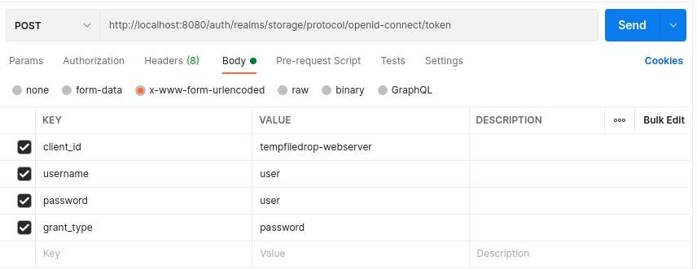

# Keycloak

Using Keycloak for authentication

## Overview

## Usage

`sudo docker-compose up -d`
    
## Useful Links

Keycloak console: http://localhost:8080/auth/

Keycloak login for users to storage realm: http://localhost:8080/auth/realms/storage/account

## Get Token using Postman

Note that you must use the **x-www-form-urlencoded** body format



## Export and Import data

Execute the following migration script to export the realm information. You will need to mount a volume to get the file
out of the docker container.

```bash
docker exec -it kc /opt/jboss/keycloak/bin/standalone.sh \
-Djboss.socket.binding.port-offset=100 -Dkeycloak.migration.action=export \
-Dkeycloak.migration.provider=singleFile \
-Dkeycloak.migration.realmName=my_realm \
-Dkeycloak.migration.usersExportStrategy=REALM_FILE \
-Dkeycloak.migration.file=/tmp/my_realm.json
```