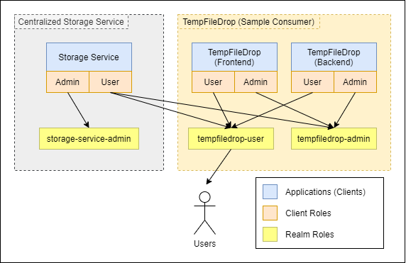

# Keycloak

Using Keycloak for authentication

- [Usage](#usage)
- [Useful Links](#useful-links)
- [Get Token using Postman](#get-token-using-postman)
- [Access Types](#access-type)
- [Role Based Access Type](#role-based-access-control)

## Usage

```bash
# Start the docker container instance (Predefined configuration can be found in storage-realm.json)
sudo docker-compose up -d

# Navigate to admin console page
http://localhost:8080/auth/

# Login using admin:admin

# Stop the docker container instance
sudo docker-compose down -v
```
    
## Useful Links

Keycloak console: http://localhost:8080/auth/

Keycloak login for users to storage realm: http://localhost:8080/auth/realms/storage/account

## Get Token using Postman

Note that you must use the **x-www-form-urlencoded** body format


## Export and Import data

Execute the following migration script to export the realm information. You will need to mount a volume to get the file
out of the docker container.

```bash
docker exec -it kc /opt/jboss/keycloak/bin/standalone.sh \
-Djboss.socket.binding.port-offset=100 -Dkeycloak.migration.action=export \
-Dkeycloak.migration.provider=singleFile \
-Dkeycloak.migration.realmName=my_realm \
-Dkeycloak.migration.usersExportStrategy=REALM_FILE \
-Dkeycloak.migration.file=/tmp/my_realm.json
```

## Access Type

- **Public** - for applications which requires browser logins
- **Confidential** - for mixture of web applications and API.
- **Bearer-only** - for API Microservices. No browser login available.

For micro-service to call microservice, the caller must be **confidential** and callee must be **bearer-only**

## Role Based Access Control



### Web Applications

1. **Create Client**.
    - In the left panel, navigate to `Configure > Clients`.
    - Click on `Create`. Provide the **Client ID** and **Root URL**.
    - In the `Settings tab` of the newly created client, set **Access Type** to **public**.
2. **Create Client Roles**
    - In the `Roles tab` of the client, click on `Add Role` and create **user** and **admin** role.
3. **Create a new authentication flow**
    - In the left panel, Navigate to `Configure > Authentication`.
    - Select the `Browser Flow` and **make a copy of the flow**. Name it **Browser Role Access Control**
    - At the end of `Browser Role Access Control Forms` row, Click on `Actions > Add Execution`.
    - Select `Script` from the provider list and hit Save.
    - Move the entry until it is below the `User Password Form` row.
    - Set the requirement to **REQUIRED** for the `Script` row
    - At the end of `Script` row, click on `Actions > Config` and add the script.
        ```javascript
        AuthenticationFlowError = Java.type("org.keycloak.authentication.AuthenticationFlowError");
        
        function authenticate(context) {
        
            var username = user ? user.username : "anonymous";
            LOG.info(script.name + " trace auth for: " + username);
        
            var client = session.getContext().getClient();
            var userRoleModel = client.getRole("user");
            var adminRoleModel = client.getRole("admin");
        
            if (!user.hasRole(userRoleModel) && !user.hasRole(adminRoleModel)) {
                context.forkWithErrorMessage(new FormMessage('label', 'User is not allowed to access this client.'));
                return;
            }
        
            context.success();
        }
        ```
    - At the final step, navigate to `Configure > Clients > YOUR_CLIENT > Settings > Authentication Flow Overrides`.
    - Select the **new authentication flow** for the **Browser Flow**
4. **Tag Client Role to Realm Role**
    - Navigate to `Configure > Roles` and click on `Add Row`
    - Give the role a name and hit save
    - Toggle `Componsite Roles` on and select **YOUR_CLIENT** from the `client roles`
    - Add the appropriate role to the realm role.

### Rest API Microservices

Similar to the web application above, 
1. **Create Client**
    - Follow the same step above but set **Access Type** to **bearer-only**.
2. **Create Client Role** (same as above)
3. **Tag Client Role to Realm Role** (same as above)
