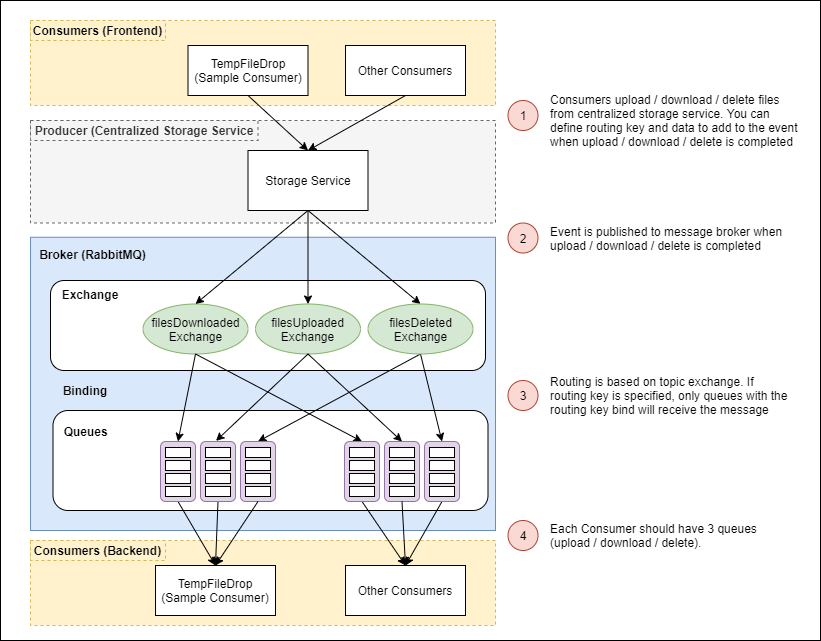

# Storage Service

Storage Service that provides REST API Endpoints for **uploading, downloading and listing** files stored in either 
**file storage (Folders)** or **object storage (MinIO)**

- [Getting Started](#getting-started)
    - [Configuring application.yaml](#configuring-applicationyaml)
    - [Running the service (locally)](#running-the-service-locally)
    - [Deploy the service](#deploying-the-service)
- [Documentation](#documentation)
    - [Storage Service Design](#storage-service-design)
        - [StorageId](#more-about-storageid)
    - [Database Tables](#database-tables)
    - [API Endpoints](#api-endpoints)
- [How to consume Centralized Storage Service](#how-to-consume-centralized-storage-service)
    - [1. How to upload files](#1-uploading-files)
    - [2. How to add routingkey and custom data](#2-adding-routing-key-and-custom-data)
    - [3. How to consume event](#3-consuming-the-event)
    
## Getting Started

### Configuring application.yaml

| Property Group | Property | Remarks |
| --- | --- | --- |
| storagesvc | storage-mode | Choice of storage mode = file / object |
| storagesvc.file-storage | upload-path | directory to upload files to |
| storagesvc.object-storage | minio-endpoint | endpoint of minio cluster |
| storagesvc.object-storage | minio-access-key | access key for minio cluster |
| storagesvc.object-storage | minio-access-secret | access secret for minio cluster |

### Running the service (Locally)

```bash
cd <ROOT>
./gradlew storage-service:bootRun
```

### Deploying the service

TO BE ADDED...

## Documentation

### Storage Service Design


The centralized storage service is an abstraction layer over **storage medium** where the bulk of the exploration is based
on **Object Storage** with **MinIO**. Below are some of the key features available in the centralized storage service:
1. **Scheduled Files Cleanup**
    - Uploaded files can have an **expiry datetime** or **maximum download count** as a mechanism to store files temporary.
    - A **cronjob** is executed daily to clean up files that have expired.
    - **Expiry datetime** have **5 options**:
        - 1 hour
        - 1 day
        - 1 week
        - 1 month
        - no expiry 
2. **Event Feedback**
    - when files are uploaded / downloaded / deleted, an event will be triggered.
    - consumers can tagged the event with a **routingkey** such that only they will receive the event message.

#### More about StorageId


- Each upload is tag to a **storageId** which is stored as **metadata** in the database
- Following S3 convention, the consumer should have a **bucket** available in order to upload files

### Database Tables

| Table | Columns | Description |
| --- | --- | --- |
| storage_info | **id**, bucketName, storagePath,  filenames, numOfDownloadsLeft, expiryDatetime, downloadLink | {storageId to files/object uploads} mapping. Given the **id** AKA **storageId**, the storage service will be able to identify the files uploaded and make them available for download. |
| storage_files | id, bucketName, storagePath, filename, originalFilename, fileContentType, fileLength, storageId | Contains the uploaded files details |

### API Endpoints

| Request Type | Endpoints | Description |
| --- | --- | --- |
| GET | /storagesvc/{bucket} | get contents inside bucket |
| POST | /storagesvc/upload | upload files using multi-part request |
| POST | /storagesvc/uploadV2 | upload files using multi-part request using streaming |
| DELETE | /storagesvc/{bucket}/{storageId} | delete files from storage using bucket name and storageId |
| GET | /storagesvc/storageinfo/{bucket}/{storageId} | get storage information using bucket name and storageId |
| POST | /storagesvc/storageinfo/bulk | get multiple storage information using bucket name and multiple storageId |
| GET | /storagesvc/download/{bucket}/{storageId} | download files using bucket name and storageId |

### Events

After delete / download / upload of files, an event will be triggered. Refer to the diagram below for more details.



## How to consume Centralized Storage Service

Refer to this section on how to consume the centralized storage service. There are 3 main configurations you will need to
consume the centralized storage service.
- **How to upload files**
- **Defining routingkey and data for delete / download / upload**
- **Consuming the Event**

### 1. Uploading Files

When uploading files, you will be required to attach metadata (json object) to the upload. The metadata required is as
follows:

```bash
{
    bucket: "name_of_bucket",                               
    storagePath: "some/path",          
    maxDownloads: 1,
    expiryPeriod: 0,              
    eventRoutingKey: "routingkey",
    eventData: JSON.stringify({ key: "value" })
}
```

- **bucket**: your bucket
- **storagePath**: path to storage your file in the bucket. Can be an empty string which will store in root of bucket.
- **maxDownloads**: maximum number of downloads before file is deleted.
- **expiryPeriod**: this is an index value.
    - **0** = 1 hour
    - **1** = 1 day
    - **2** = 1 week
    - **3** = 1 month
    - **4** = no expiry
- **eventRoutingKey**: This is an **OPTIONAL** field. When upload is completed, an event will be published to the message
broker. This allows you to customize the event such that only queues with this routing key will retrieve the message.
- **eventData**: This is an **OPTIONAL** field. When upload is completed, an event will be published to the message 
broker. This allows you to pass data to the consumer.

#### Using Javascript (React + Axios)

```javascript
const uploadfunction = (uploadedFiles, userInfo) => {
    const formData = new FormData();
    const metadata = {
        bucket: "tempfiledrop",
        storagePath: "some/path",
        maxDownloads: 1,
        expiryPeriod: 0,        // 0 = 1 hour, 1 = 1 day, 2 = 1 week, 3 = 1 month, 4 = No Expiry
        eventRoutingKey: "tempfiledrop_upload",
        eventData: JSON.stringify({ username: username })
    };
    formData.append("metadata", new Blob([JSON.stringify(metadata)], {
        type: "application/json"
    }));    
    uploadedFiles.forEach(file => {
        formData.append("files", file);
    });

    // send request
    axios.post("/storagesvc/upload", formData, {}) {
        ...
    }       
};
```

#### Using Kotlin (Spring MVC with RestTemplate)

```kotlin
data class StorageInfo(
        val bucket: String,
        val folder: String
)
```

```kotlin
@PostMapping("/upload", consumes = [MediaType.MULTIPART_FORM_DATA_VALUE])
fun uploadFile(
        @RequestPart("files", required = true) files: List<MultipartFile>,
        @RequestPart("metadata", required = true) metadata: StorageInfo
): ResponseEntity<FileStorageResponse> {
    // craft header
    val headers = HttpHeaders()
    headers.contentType = MediaType.MULTIPART_FORM_DATA
    
    // craft body
    val body: MultiValueMap<String, Any> = LinkedMultiValueMap()
    body.add("metadata", metadata)
    files.forEach { body.add("files", it.resource) }
    
    // craft request
    val requestEntity: HttpEntity<MultiValueMap<String, Any>> = HttpEntity(body, headers)
    
    // craft rest template
    val storageServiceUrl = "http://storage.service.com/upload"
    val restTemplate = RestTemplate()
    val response = restTemplate.postForEntity(storageServiceUrl, requestEntity, String::class.java)
}
```

### 2. Adding Routing Key and Custom Data

Similar to upload, you can define **eventRoutingKey** and **eventData** when deleting / downloading files. Code samples
are as follows:

#### Download example

```javascript
axios.get(`/storagesvc/<BUCKET_NAME>/<STORAGE_ID>`, {
    responseType: "blob",
    params: {
        eventRoutingKey: "routingkey"
    }
})
    .then(res => {
        const filename = extractFilenameFromContentDisposition(res.headers);
        const url = window.URL.createObjectURL(new Blob([res.data]));
        const link = document.createElement('a');
        link.href = url;
        link.setAttribute('download', filename);
        document.body.appendChild(link);
        link.click();
    })
    .catch(err => {
        console.log(err);
    });
```

#### Delete example

```javascript
 axios.delete(`/storagesvc/<BUCKET_NAME>/<STORAGE_ID>`, {
    params: {
        eventData: JSON.stringify({ key: "value" }),
        eventRoutingKey: "routingkey"
    }
})
    .then(res => console.log(res))
    .catch(err => console.log(err));
```

### 3. Consuming the Event

To consume the event, follow the steps below

1. Install Dependencies - Spring Cloud Stream and RabbitMQ Binder
    ```bash
    dependencies { 
        implementation("org.springframework.cloud:spring-cloud-starter-stream-rabbit")
    }
    ```
2. Add configuration in **application.yaml** to bind queues to the **3 exchange (delete / download / upload)**
    ```yaml
    spring:
      rabbitmq:
        addresses: localhost:5672
        username: storage_user
        password: storage123
      cloud:
        function:
          definition: filesDownloadedChannel;filesUploadedChannel;filesDeletedChannel
        stream:
          rabbit.bindings:
            filesDownloadedChannel-in-0.consumer:
              binding-routing-key: tempfiledrop_download
            filesUploadedChannel-in-0.consumer:
              binding-routing-key: tempfiledrop_upload
            filesDeletedChannel-in-0.consumer:
              binding-routing-key: tempfiledrop_delete
          bindings:
            filesDownloadedChannel-in-0:
              destination: filesDownloadedExchange 
              group: tempfiledrop                  
            filesUploadedChannel-in-0:
              destination: filesUploadedExchange   
              group: tempfiledrop                  
            filesDeletedChannel-in-0:
              destination: filesDeletedExchange    
              group: tempfiledrop                 
    ```
    - **spring.cloud.rabbitmq** - RabbitMQ Cluster configuration
    - **spring.cloud.function.definition** - Notice, the names defined here. They will correspond with our consumers which
    will be defined later...
    - **spring.cloud.stream.rabbit.bindings** - define your routing keys here
    - **spring.cloud.stream.bindings: - define the bindings here. These will created queues which are binded to the exchange.
3. Create Consumer Class
    ```kotlin
    @Component
    class RabbitMQConsumer{
        companion object {
            private val logger = LoggerFactory.getLogger(RabbitMQConsumer::class.java)
        }
    
        @Bean
        fun filesDeletedChannel(): Consumer<EventMessage> = Consumer {
            logger.info("Received Files Deleted Event From Storage Service: {}", it)
        }
    
        @Bean
        fun filesDownloadedChannel(): Consumer<EventMessage> = Consumer {
            logger.info("Received Files Downloaded Event from Storage Service: {}", it)
        }
    
        @Bean
        fun filesUploadedChannel(): Consumer<EventMessage> = Consumer {
            logger.info("Received Files Uploaded Event from Storage Service: {}", it)
   
            val objectMapper = ObjectMapper().registerKotlinModule()
            val data = objectMapper.readValue(it.data, CustomData::class.java)
        }
    }
    ```
    - Refer to **filesUploadedChannel** for example on how to extract your data **eventData** specified when you upload
    files


