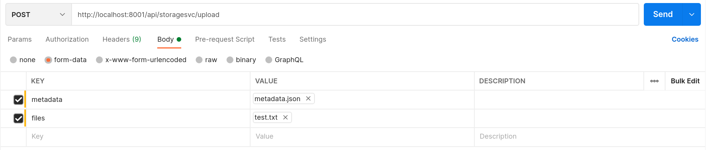

# Web Server

This is the dedicated Backend web server for TempFileDrop.io built using Spring Boot Framework. The main tasks of this server is
to serve data, handle logins & registration and process file uploads/downloads.

- [Usage](#usage)
- [Documentation](#documentation)
    - [API Endpoints](#api-endpoints)
    - [Database Tables](#database-tables)
    - [Testing File Uploads](#testing-file-uploads-api)

## Usage

```bash
cd <ROOT>
./gradlew webserver:bootRun
```

## Documentation

### API Endpoints

| Endpoints | Description |
| --- | --- |
| /user-info | used for mocking login |
| /uploads | List & Delete uploads (both records in users_uploads table as well as objects itself) |
| /files | uploading and downloading for files |

### Database Tables

| Table | Columns | Description |
| --- | --- | --- |
| users | id, username, password, creationDate | used for mocking login |
| users_uploads | id, folder, uploadedFiles, storageId, downloadLink | {users to uploads} mapping. Information about the active uploads that users have which is used to display in Dashboard page. **StorageId** is the reference ID used to obtain the "files" itself from the storage service. |

### Testing File Uploads (API)

Ensure `mongoDB`, `minIO` and `storage-service` is up. To test uploading of files, use `Postman` and use the settings below


